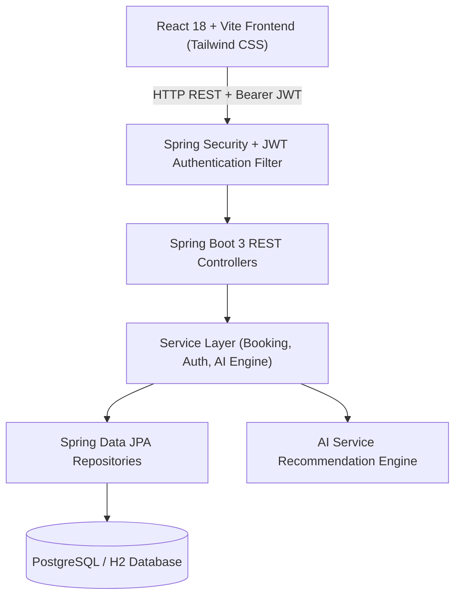

# 🚀 10 LPA Job Crack Guide & Resume Handbook: LocalFix Platform

This guide provides technical interview answers, architecture diagrams, resume bullet points, and key engineering decisions designed to help freshers crack **10+ LPA Software Development Engineer (SDE / Full Stack / Java Backend)** interviews using this project.

---

## 📌 1. Resume Project Bullets (Copy-Paste Ready)

### Option A: For Java / Backend Developer Roles
- **Built a Production-Grade Local Services Booking Platform** using **Java 21, Spring Boot 3, Spring Security, Spring Data JPA, and PostgreSQL**.
- **Designed Stateless JWT Authentication** with BCrypt password hashing, role-based access control (`CUSTOMER`, `VENDOR`, `ADMIN`), and fine-grained method-level security (`@PreAuthorize`).
- **Implemented a 2-Step OTP Verification Engine** for service technicians at job start and completion, eliminating fraudulent completions and ensuring service guarantee compliance.
- **Engineered an AI-Driven Problem Diagnostic Assistant** that parses natural language customer complaints to classify severity, estimate repair costs, and recommend verified service providers.
- **Architected RESTful APIs with Swagger/OpenAPI 3.0 documentation**, optimized DTO mappings, and managed database migrations with automated data seeding routines.

### Option B: For Full-Stack / React Developer Roles
- **Developed a Scalable Multi-Tenant Service Marketplace** with **React 18, Vite, Tailwind CSS, Spring Boot 3, and PostgreSQL**.
- **Integrated Dynamic Promo Code Calculation Engine** enabling live coupon redemption (`FIRSTFIX10`, `SUPERHOME20`), subtotal updates, and tax breakups on frontend checkout.
- **Built Interactive Real-Time Status Timelines & Analytics Dashboards** using **Recharts**, Lucide icons, and toast notification alerts for Customer, Vendor, and Admin portals.

---

## 🏗️ 2. High-Level System Architecture



---

## 💡 3. Key Design Patterns & Engineering Concepts Used

1. **DTO (Data Transfer Object) Pattern**:
   - Isolates database entity models (`Booking`, `User`, `ServiceItem`) from REST API payload responses (`BookingDto`, `CreateBookingRequest`) to prevent over-posting vulnerabilities and cyclical JSON reference deadlocks.
2. **Builder Design Pattern**:
   - Used Fluent Builder pattern (`Booking.builder()...build()`) across all JPA entities and DTOs for safe immutability and readable object instantiation.
3. **Repository Pattern (Spring Data JPA)**:
   - Encapsulates database queries using custom repository query methods (`findByCustomerIdOrderByCreatedAtDesc`).
4. **Stateless JWT Security Filter Chain**:
   - Every request is intercepted by custom `JwtAuthenticationFilter`, parsing HTTP `Authorization: Bearer <token>`, validating expiration and cryptographic signatures, and building the Spring `SecurityContextHolder`.

---

## ❓ 4. Expected Technical Interview Questions & Perfect Answers

### Q1: How did you implement Authentication and Role-Based Authorization?
**Answer**:
> "I used **Spring Security with JWT tokens**. Upon successful login at `/api/auth/login`, the backend verifies credentials via `AuthenticationManager` with BCrypt hashing and issues a signed JWT token containing claims (User ID, Email, Role). On subsequent requests, a custom `JwtAuthenticationFilter` inspects the Authorization header, validates the signature, extracts the user principal, and sets `SecurityContextHolder`. Controller endpoints enforce role restrictions using `@PreAuthorize("hasRole('VENDOR')")` annotations."

### Q2: How does the OTP Verification mechanism work?
**Answer**:
> "When a booking is created, the system auto-generates a secure 4-digit verification code stored in the `Booking` entity. When the technician arrives, the customer shares this code. The vendor submits the OTP via the status update endpoint (`PATCH /api/vendor/bookings/{id}/in-progress?otp=...`). The `BookingService.verifyAndTransitionStatus` method verifies the OTP against database state before allowing status progression, ensuring end-to-end service authenticity."

### Q3: How is database persistence handled for local development vs production?
**Answer**:
> "By default, the application runs on **H2 In-Memory Database** out-of-the-box for zero-setup execution, seeded automatically by `DataInitializer`. For production deployments, it connects seamlessly to **PostgreSQL** using Docker Compose configuration without changing code logic."

---

## 🧪 5. How to Demo This Project to an Interviewer

1. **Start Backend & Frontend**:
   ```bash
   # Terminal 1: Backend
   cd backend
   .\mvn_bin\bin\mvn.cmd spring-boot:run

   # Terminal 2: Frontend
   cd frontend
   npm run dev
   ```
2. **Open Browser**: Navigate to `http://localhost:5173`.
3. **Showcase AI Diagnosis**: Click **AI Recommender**, type *"My kitchen sink pipe burst and water is flooding"*, show instant AI diagnosis result & price estimate.
4. **Showcase Customer Checkout & Coupon**: Click a service, type promo code `FIRSTFIX10`, show live ₹ discount deduction.
5. **Showcase Vendor OTP Workflow**: Login as Vendor (`vendor@localfix.com` / `Vendor@123`), open incoming bookings, enter customer's 4-digit OTP code to start and complete job!
